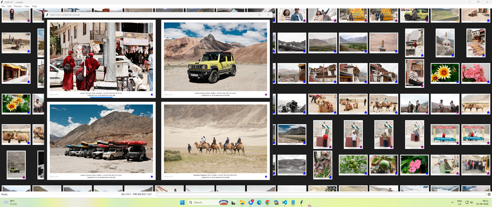
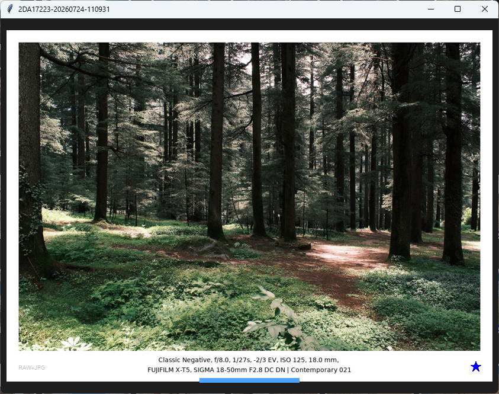
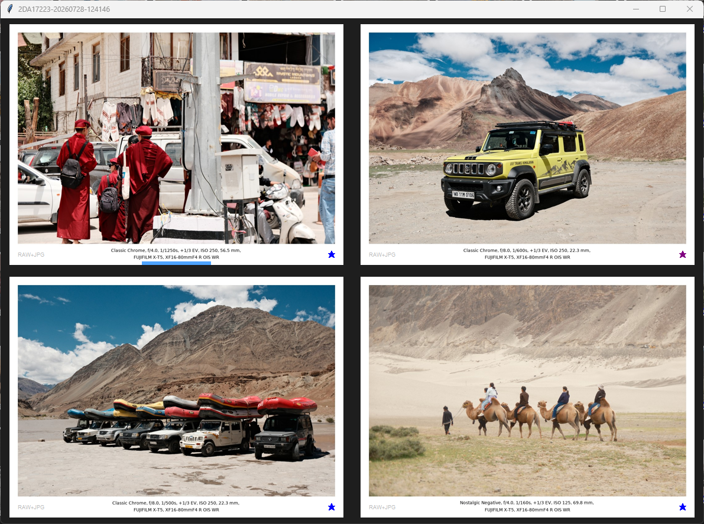
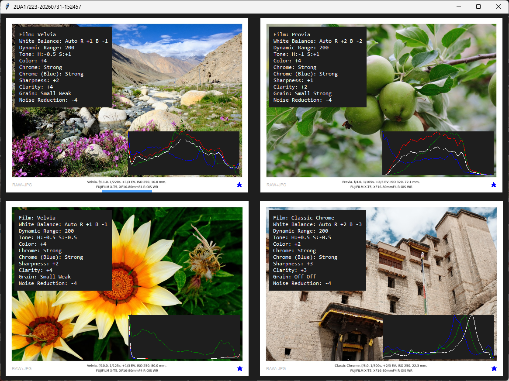
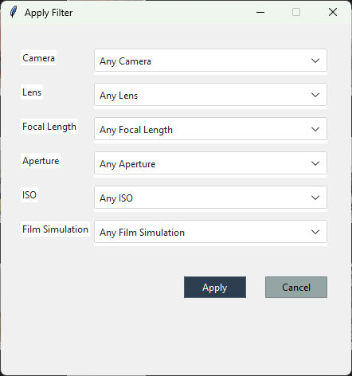

## Screenshots

### Archive & Thumbnail View

Filmroll provides a fast, thumbnail-based view of an image archive, with
ratings, photographic metadata and previews visible directly in the grid.

### Loupe & Image Review

Open an image for detailed inspection with metadata, histogram, rating,
zoom and navigation controls.

### Compare

Select up to four images and review them side-by-side with synchronized
navigation and inspection.

### Fujifilm Metadata & Film Simulation

Filmroll exposes Fujifilm-specific shooting information directly alongside
the images, including film simulation, white balance and fine-tuning,
Dynamic Range, tone and colour settings, Color Chrome effects, sharpness,
clarity, grain and noise reduction. RGB histograms are also available
during image review.

### Metadata Filtering

Filter an archive using photographic metadata such as camera, lens,
focal length, aperture, ISO and film simulation.

## Important Note

If you simply want to use Filmroll, download the latest pre-built release from GitHub release page. You only need to clone this repository if you want to access, inspect, modify or build the source code.
Users are strongly recommended to use latest version.

Windows Executable: Download filmroll.zip from github release and unzip in a suitable folder. Double click the .exe file to run.

Linux AppImage: Download the AppImage file from github release and mark it executable before running

~~~bash
chmod +x Filmroll-x86_64.AppImage
./Filmroll-x86_64.AppImage
~~~

## Configuration
#### FUJIFILM X RAW STUDIO
On Windows machine, change this settings if you do not have xrawstudio installed on your computer or it is installed in a different path. Note that this setting has no effect on Linux, as FUJIFILM X RAW STUDIO is not available for Linux. Filmroll itself runs normally without X RAW STUDIO.

from
~~~python
"xrawstudio_path": "C:\\Program Files\\FUJIFILM X RAW STUDIO\\FUJIFILM_X_RAW_STUDIO.exe"
~~~
 to
 ~~~python
"xrawstudio_path": ""
~~~

## About Filmroll

Filmroll is an open-source image archive and review tool built with FUJIFILM photographers in mind.

It organises the different representations of a capture—RAW, JPEG, TIFF and Filmroll preview—in a stacked view, while exposing FUJIFILM-specific metadata such as film simulation, white balance, Dynamic Range, tone, colour, Color Chrome, sharpness, clarity, grain and noise reduction.

Filmroll provides metadata-aware file ingestion and filtering, ratings, archive management, detailed Loupe inspection, histograms, notes and side-by-side comparison of up to four images.

**Your archive remains your archive.** Filmroll does not lock your photographs into a proprietary database or catalog. Your images remain ordinary files organised in your native filesystem, which means they can be accessed, backed up, copied or managed independently of Filmroll. Filmroll's archive information is simply associated with those files rather than replacing them with a software-controlled database. **Filmroll does not modify your original files.**

Filmroll is not a RAW developer or image editor. It is designed to complement those tools by providing a focused workflow for ingesting, organising, inspecting, comparing and reviewing your photographic archive.

## Who is Filmroll for?

Filmroll is for photographers who want a simple, transparent way to organise and review their photographs without handing their archive over to a proprietary catalog system. It is particularly suited to FUJIFILM photographers who shoot RAW+JPEG, use Film Simulations and other in-camera settings, and want those photographic decisions to remain visible and searchable alongside their images.

Filmroll is a good fit if you:

- FUJIFILM shooter
- Shoot RAW+JPEG and want the different versions of a capture presented together.
- Want to review and compare photographs quickly without opening a full RAW editor.
- Care about FUJIFILM-specific metadata and Film Simulation settings.
- Want metadata-based filtering, ratings and archive organisation.
- Prefer your photographs to remain ordinary files on your own filesystem, rather than being locked into a proprietary catalog.
- Want an open-source, lightweight desktop application that stays focused on archiving and review.

Filmroll is for photographers who want control over their files, visibility into their camera's metadata, and a straightforward way to review their work — without adding another complicated system between them and their photographs.

### Developers

Want to build Filmroll from source or contribute to the project?

- See the [Development Guide](DEVELOPMENT.md).

- See the [Changelog](CHANGELOG.md) for release history.

